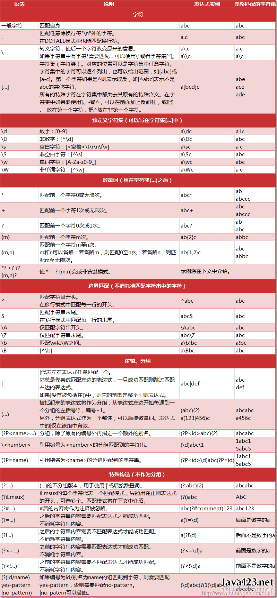

# 正则表达式的简单介绍

## 匹配多种可能性：[]

```
let regExp = r[ua]n
regExp.test(regExp)
```

- example:

  `[A-Z][a-z] [0-9][a-za-z0-9]`

## 匹配数字或者非数字

- `\d` : decimal digit;
  ```JavaScript
  let regExp = /r[\d]n/;
  regExp.test("r4n") // return true
  ```
- `\D` : any non-decimal digit

  ```JavaScript
  let regExp = /r[\D]n/;
  regExp.test("r4n") // return False
  regExp.test("rpn") // return ture

  ```

## 匹配空白

- `\s` : any white space `/[\t\n\r\f\v]/`

```javaScript
var regExp = /\s/;
```

- `\S` : opposite to \s, any non-white space

## 所有数字、字母和"\_"

- `\w` : equivalent with `[A-Za-z0-9_]`
- `\W` : opposite to `\w`

## 空白字符

- `\b` : empty string(only at the start or end of the word)

```javaScript
let regE = /\bruns\b/;
regE.test("dog runs to cat"); //return true
regE.test("dogrunstocat");//return false
```

- `\B` : empty string (but not at the start or end of a word)

```javaScript
let regE = /\B runs \B/;

```

## 特殊字符 任意字符

- `\\` : match \ (转义字符)

- `.` : match anything(except `\n`)

## 句首句尾

- `^` : match line beginning

- `$` : match line ending

## 非

- `^` should in [ ]

```javascript
let regEx = /[^\d+]/;
regEx.test("00123"); //false
regEx.test("abc"); //true
```

## 出现次数问题

### 1. 是否

有或者没有。（出现 0 次或者出现 1 次，等价于`{0,1}`)

- `?` : may or may not occur

```javascript
let regEx = /Mon(day)?/;
regEx.test("Mon");
regEx.test("Monday");
//Both will return true
```

### 2. 零次或多次

- `*` : occur 0 or more times;

```javascript
let regEx = /ab*/;
regEx.test("a"); //true
regEx.test("abbbbb"); //true
```

### 3. 一次或多次

- `+` : occur 1 or more times;

```javascript
let regEx = /ab+/;
regEx.test("a"); //false
regEx.test("ab"); //true
regEx.test("abbbbb"); //true
```

### 4. 自选次数

`{n,m}` : occur n to m times

```javascript
let regEx = /a(b){2,10}/;
regEx.test("ab"); //false
regEx.test("abb"); //true
```

## group 组

"[ ]"是匹配一个字符，而"()"是匹配一组字符

- `()`内的一组匹配字符

```javascript
let reg1 = /r[ua]n/;
let reg2 = /r(u|a)n/; // 这个和reg1的返回结果并不一样，它返回 n 或者 a
let reg3 = /(run|ran)/; //这个和reg1返回结果相同
```

- `(x)`

  像下面的例子展示的那样，它会匹配 'x' 并且记住匹配项。其中括号被称为捕获括号。

  模式 /(foo) (bar) \1 \2/ 中的 '(foo)' 和 '(bar)' 匹配并记住字符串 "foo bar foo bar" 中前两个单词。模式中的 \1 和 \2 表示第一个和第二个被捕获括号匹配的子字符串，即 foo 和 bar，匹配了原字符串中的后两个单词。注意 \1、\2、...、\n 是用在正则表达式的匹配环节，详情可以参阅后文的 \n 条目。而在正则表达式的替换环节，则要使用像 $1、$2、...、$n 这样的语法，例如，**'bar foo'.replace(/(...) (...)/, '$2 $1')**。$& 表示整个用于匹配的原字符串。

## 先行断言

匹配'x'仅仅当'x'后面跟着'y'.这种叫做先行断言。

例如，`/Jack(?=Sprat)/`会匹配到'Jack'仅仅当它后面跟着'Sprat'。`/Jack(?=Sprat|Frost)/`匹配‘Jack’仅仅当它后面跟着'Sprat'或者是‘Frost’。但是‘Sprat’和‘Frost’都不是匹配结果的一部分。

## 后行断言

匹配'x'仅仅当'x'前面是'y'.这种叫做后行断言。

例如，`/(?<=Jack)Sprat/`会匹配到' Sprat '仅仅当它前面是' Jack '。`/(?<=Jack|Tom)Sprat/`匹配‘ Sprat ’仅仅当它前面是'Jack'或者是‘Tom’。但是‘Jack’和‘Tom’都不是匹配结果的一部分。

## 常用正则表达式

| 类别                     | 实例                                                                                            |
| :----------------------- | :---------------------------------------------------------------------------------------------- |
| 用户名                   | `/^[a-z0-9_-]{3,16}\$/`                                                                         |
| 密码                     | `/^[a-z0-9_-]{6,18}\$/`                                                                         |
| 十六进制值               | `/^#?([a-f0-9]{6} | [a-f0-9]{3})\$/`                                                            |
| 电子邮箱                 | `/^([a-z0-9_\.-]+)@([\da-z\.-]+)\.([a-z\.]{2,6})\$/`                                            |
| 电子邮箱                 | `/^[a-z\d]+(\.[a-z\d]+)\*@([\da-z](-[\da-z])?)+(\.{1,2}[a-z]+)+\$/`                             |
| URL                      | `/^(https?:\/\/)?([\da-z\.-]+)\.([a-z\.]{2,6})([\/\w \.-]*)*\/?$/`                              |
| IP 地址                  | `/((2[0-4]\d|25[0-5]|[01]?\d\d?)\.){3}(2[0-4]\d|25[0-5]|[01]?\d\d?)/`                           |
| IP 地址                  | `/^(?:(?:25[0-5]|2[0-4][0-9]|[01]?[0-9][0-9]?)\.){3}(?:25[0-5]|2[0-4][0-9]|[01]?[0-9][0-9]?)$/` |
| HTML 标签                | `/^<([a-z]+)([^<]+)*(?:>(.*)<\/\1>|\s+\/>)$/`                                                   |
| 删除代码\\注释           | `(?<!http:|\S)//.*$`                                                                            |
| Unicode 编码中的汉字范围 | `/^[\u2E80-\u9FFF]+$/`                                                                          |

## 参考资料

## 表格

| 字符 | 含义 |
| :--- | :--- |
| \    | 18   |


[表达式全集]: https://tool.oschina.net/uploads/apidocs/jquery/regexp.html

[正则表达式中的特殊字符]: https://developer.mozilla.org/zh-CN/docs/Web/JavaScript/Guide/Regular_Expressions#note
